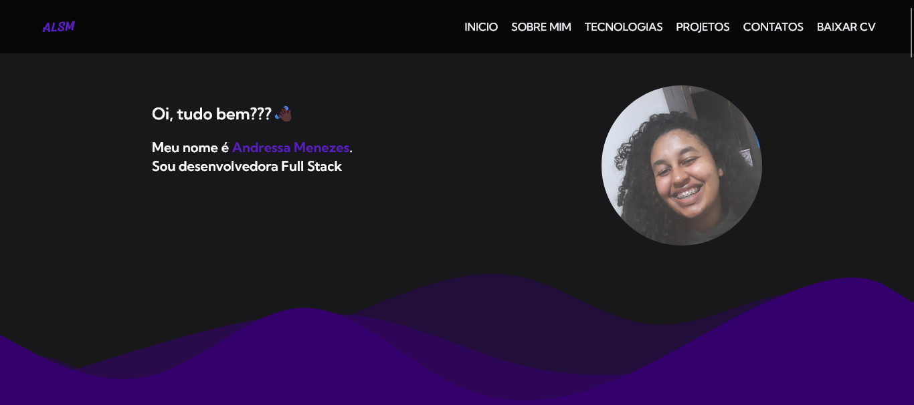

<h1>
  Meu Portfolio Pessoal
</h1>

    
    

<h2>🪧 Guia</h2>

- <a href="#howToAccess">Como acessar</a>
   
- <a href="#AboutTheProject">Sobre o projeto</a>
   
- <a href="#techs">Tecnologias Utilizadas</a>

---

<h2 id="howToAccess">🖱️Como acessar?</h2>

<a href="https://portfolio-one-rho-95.vercel.app/">Para conferir e utilizar o projeto clique aqui</a>.

<h2 id="AboutTheProject">✏️ Sobre o projeto</h2>

## 📚 Seções

O site é composto por cinco seções:

- **Home:** Nele temos uma breve apresentação;
- **Sobre Mim:** Nessa seção tenho uma descrição dizendo um pouco sobre quem sou;
- **Tecnologias Que Eu Sei:** Nele apresentamos meus conhecimentos em algumas linguagens;
- **Meus Projetos:** Apresenta alguns projetos desenvolvidos e com link direto para os respectivos códigos no GitHub e Demo;
- **Contatos:** Exibe todos os contatos;

---

<h2 id="techs" >💼 Tecnologias utilizadas</h2>

Para o desenvolvimento deste site utilizei as seguintes tecnologias:

- [x] ReactJS;
- [x] TypeScript;
- [x] Git
- [x] Github

<h3>📚 Bibliotecas utilizadas</h3>
 
- [x] TailwindCSS
- [x] React-icons
- [x] Yup
- [x] Axios
